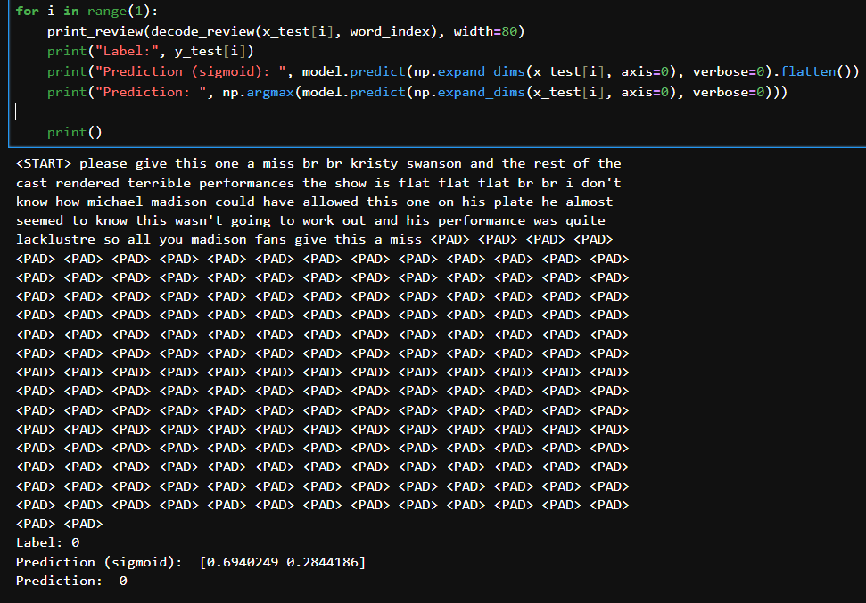
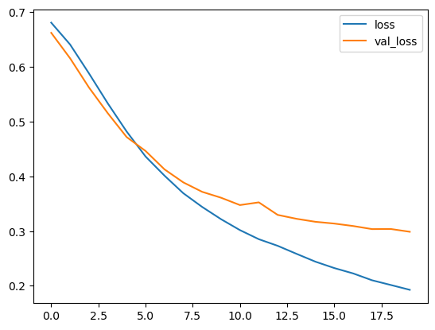
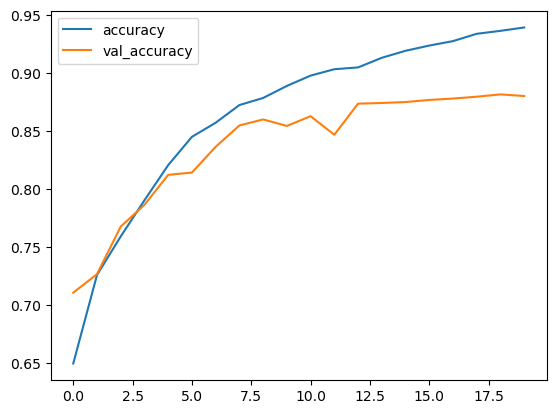
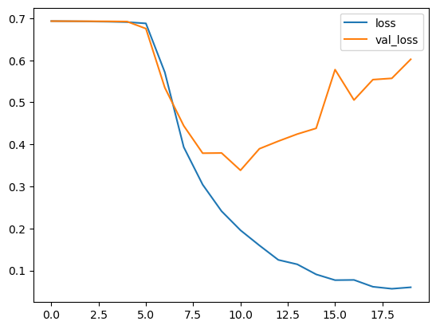
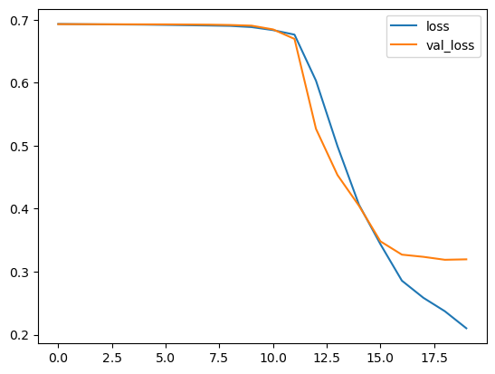

[](https://www.linkedin.com/in/richardrafi/)
[](https://www.python.org/)

# Projeto de Análise de Sentimento de avaliações do IMDB

O IMDb (Internet Movie Database) é uma plataforma online que reúne um vasto banco de dados com informações sobre filmes, séries, jogos e tudo relacionado ao mundo do entretenimento. O site oferece detalhes completos sobre elenco, produção, sinopse e a avaliação das obras.

Além de se destacar como um dos maiores sites a respeito sobre filmes, o IMDb se destaca por suas avaliações. O usuário pode escolher a série que acabou de assistir na TV, ou em serviços de streaming como a Netflix, Amazon Prime, Disney+, e avaliá-la entre 1 a 10 estrelas, além de realizar comentários, seja positivos ou negativos, sobre a obra, elenco, diretor e outros aspectos da produção.

## Detalhes do dataset

Para realizar este projeto, foi utilizado um conjunto de dados disponível no site do Keras, que contém 25000 comentários sobre os filmes para treino e teste, e que foram rotuladas por sentimento (0 - Negativo/1 - Positivo), as resenhas sofreram um pré-processamento e cada uma delas foi codificada em uma lista de índices de palavras, que estão em números inteiros. Para maior conveniência, as palavras são codificadas de acordo com sua frequência dentro da base de dados, sendo que o número 3, equivale a 3ª palavra que mais aparece na base. 

**NOTA:** Por convenção, o número 0 não tem registro de nenhuma palavra, e ela é utilizada para codificar o token PAD.



[Link original para o dataset](https://keras.io/api/datasets/imdb/)

Este projeto aplicou conceitos de Deep Learning para determinar se uma resenha de filme é positiva ou negativa. Foram utilizadas técnicas de manipulação de strings, além de estratégias para definição e treinamento do modelo, incluindo camadas como `InputLayer`, `Embedding` e `LSTM`, bem como métodos de compilação e otimização, como `Adam` e `SparseCategoricalCrossentropy`.

Após avaliar as métricas do modelo, foram inseridas resenhas de dois filmes fictícios para verificar se a previsão do sentimento da avaliação foi coerente.

As principais bibliotecas utilizadas do Python foram:

- Matplotlib –> Visualização de métricas e análises gráficas
- Numpy -> Verificação e manipulação de valores
- TensorFlow –> Construção do modelo por meio do Keras e avaliação de métricas

Este projeto foi desenvolvido no curso de Ciência de Dados da [Hashtag Treinamentos](https://www.hashtagtreinamentos.com/) e demonstra a aplicação prática de Deep Learning e técnicas para construção e avaliação de métricas do modelo no TensorFlow e Keras.

<a href="https://www.linkedin.com/in/richardrafi/" target="_blank"></a> 

## Objetivos

Este projeto tem como objetivo em desenvolver um modelo de Deep Learning capaz de classificar de forma automática resenhas de filmes como positivas (1) e negativas (0), utilizando o conjunto de dados do IMDb disponível no Keras. Foi aplicada técnicas de manipulação de texto e construção de modelo por meio de algorítimos do próprio Keras para melhorar a precisão da classificação.

Ao final, além de avaliar o desempenho do modelo, testamos também com avaliações fictícias verificando sua capacidade de prever de forma correta o sentimento associado a cada avaliação.

Objetivos detalhados:

- Passo 1: O primeiro passo foi explorar e tratar os dados utilizando a biblioteca Pandas e Seaborn. Para agilizar o processo de análise e facilitar a obtenção de insights, utilizei a biblioteca ydata_profiling, que gerou um relatório em HTML com estatísticas descritivas, valores ausentes, distribuição de variáveis e correlações. Isso permitiu entender melhor as características dos clientes e identificar possíveis tratamentos que poderiam ser feitos na base de dados, caso necessário.
  
- Passo 2: Para agrupar os clientes com perfis semelhantes, foi implementado um modelo de clustering utilizando o Scikit-Learn. O pré-processamento incluiu a aplicação do Método do Cotovelo e da Silhueta com o K-Means para determinar o número ideal de clusters a ser utilizado no pipeline, posteriormente, foi gerado o gráfico de dispersão, gráfico de caixa e um gráfico tridimensional para identificar o posicionamento dos centróides e dos pontos dos clusters, além de analisar tendências baseadas no gênero, a faixa de idade, renda e pontuação de gasto dos clientes.

- Passo 3: Similar ao passo 2, a diferença é que esta etapa, foi aplicada a técnica de Redução de Dimensionalidade com PCA dentro do pipeline de Machine Learning. A comparação dos resultados com e sem PCA demonstrou que, embora a estrutura dos clusters tenha se mantido semelhante, não houve diferença significativa nos resultados entre o modelo com ou sem redução de dimensionalidade, e sim, a diferença da segmentação dos clientes em cada cluster.

## Estrutura do repositório

O repositório está estruturado da seguinte forma:

```
├── imagens
├── notebooks
```

- Na pasta `imagens` estão as imagens utilizadas neste README.
- Na pasta `notebooks` estão os notebooks com o desenvolvimento do projeto. Em detalhes, temos:
  - [`00_rr_info_base.ipynb`](notebooks/00_rr_info_base.ipynb): notebook com as informações da base e com as versões das bibliotecas usadas no projeto.
  - [`01_rr_primeiro_modelo.ipynb`](01_rr_primeiro_modelo.ipynb): notebook com a definição, compilação e o fit do modelo em Keras no TensorFlow, além de manipulação de texto feitas por funções, e avaliação dos nossos textos criados.
  - [`02_rr_segundo_modelo.ipynb`](notebooks/02_rr_segundo_modelo.ipynb): notebook com os modelos feitos no notebook 1, com a inserção do parâmetro LSTM.
  - [`03_rr_terceiro_modelo.ipynb`](notebooks/03_rr_terceiro_modelo.ipynb): notebook que continua com os modelos feitos nos notebooks 1 e 2, com a inserção do `dropout` no LSTM para reduzir o overfitting e a redução da taxa de aprendizado.
  - [`funcoes_auxiliares.py`](notebooks/funcoes_auxiliares.py): arquivo com funções auxiliares utilizadas nos notebooks.
  

## Resumo dos resultados

No primeiro modelo, vemos que o modelo tem uma taxa de acerto de aproximadamente 87% do conjunto de teste, além de ter uma perda de 0.3174, contudo, no predict, vemos que há um ganho baixo de acurácia no modelo após o 10º `epoch`, enquanto no `val_loss` demonstra também estagnação, o que demonstra que o modelo está em overfitting. 




Após o 2º modelo ter uma perda alta de 0.73 após a inserção do LSTM, foi colocado um `dropout` de 0.5 em busca de reduzir o overfitting, o resultado foi meelhor comparado ao modelo 2, onde houve uma redução de 0.73 a 0.36 na taxa de perda, enquanto a acurácia ficou com 84.9%.




Considerando as resenhas criadas, todos os modelos testados foram capazes de prever corretamente se a resenha feita pela pessoa foi positiva ou não, os valores, remetem a porcentagem que o modelo previu se o sentimento é positivo ou negativo, e o resultado das avaliações positivas (PR) e negativas (NR) estão abaixo:

|  Modelo  | % PR1 | % PR2 | % NR1 | % NR2 |
| ---------| ----- | ----- | ----- | ----- |
|Modelo 1  | 85,9% | 87,1% | 92,5% | 66,1% |
|Modelo 2  | 95,1% | 95,1% | 87,6% | 87,6% |
|Modelo 3  | 85,7% | 85,8% | 86,4% | 85,9% |

Verificamos que o Modelo 1 teve um desempenho fraco na NR2, o que indica dificuldades em prever algumas resenhas que são negativas, no Modelo 2, ele teve o melhor desempenho em prever resenhas positivas, enquanto no 3, ele apresentou uma performance mais equilibrada nas avaliações positivas e negativas.

## Como reproduzir o projeto

O projeto foi desenvolvido utilizando o Python 3.12.5. Para reproduzir o projeto, crie um ambiente virtual com o Conda, ou ferramenta similar, com o Python 3.12.5 e instale as bibliotecas abaixo:


|  Biblioteca   |  Versão |
|-------------- | ------- |
|Matplotlib     |  3.9.2  |
|NumPy          |  2.1.3  |
|TensorFlow     | 2.19.0  |
 
Essas são as principais bibliotecas utilizadas neste projeto. 